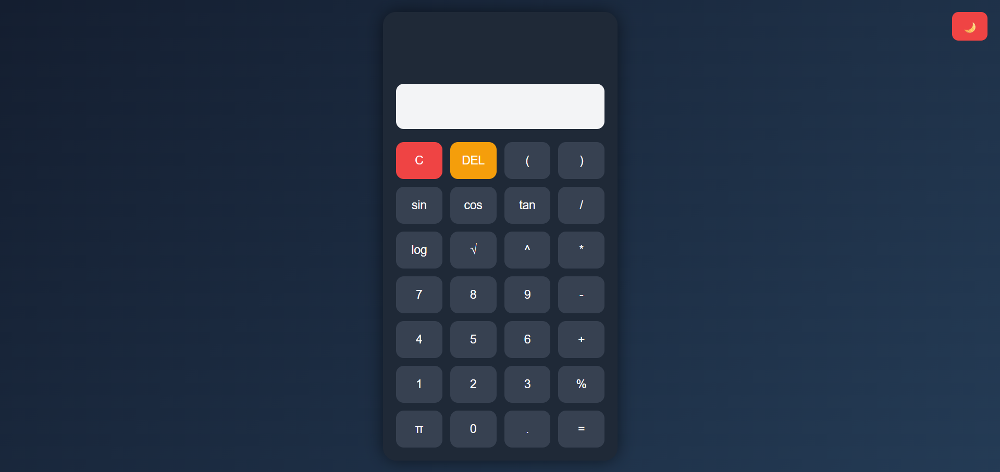
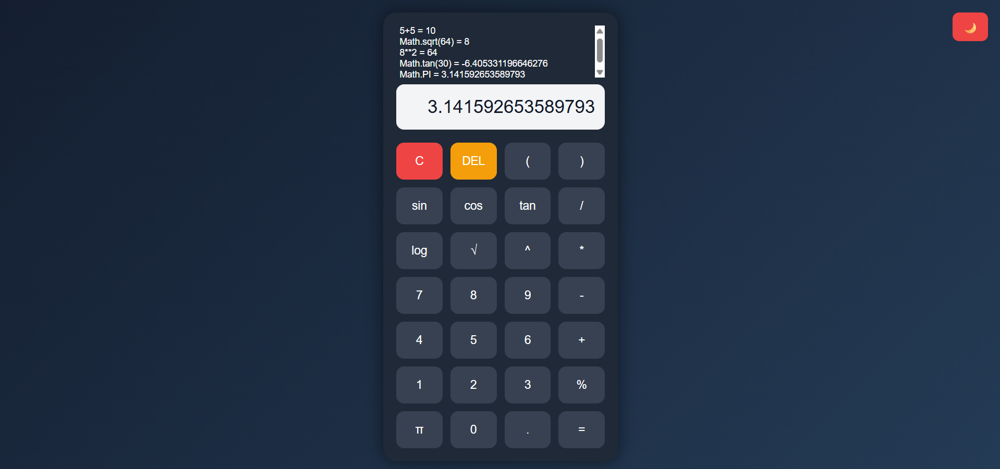
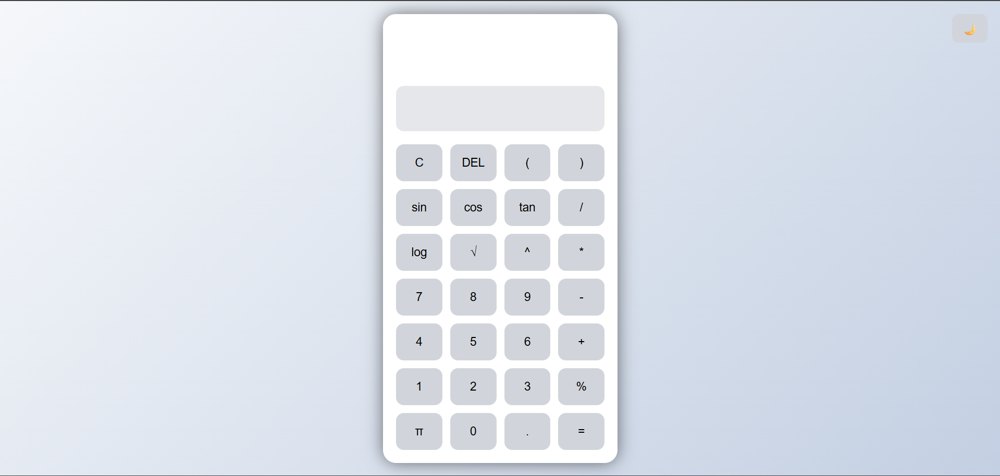

# OIBSIP - Scientific Calculator

This repository contains the Level 2 Task 1 project completed as part of the Oasis Infobyte Web Development and Designing Internship.

---

# 🚀 Project Name

Scientific Calculator

---

# 📌 Description

A modern and responsive Scientific Calculator built using HTML, CSS, and JavaScript.

This calculator performs both basic arithmetic and advanced scientific calculations with an attractive user interface. The application also supports dark/light mode switching, keyboard support, sound effects, and calculation history.

---

# ✨ Features

## 🔢 Basic Arithmetic Operations

- Addition
- Subtraction
- Multiplication
- Division
- Percentage

## 🧮 Scientific Functions

- Square Root
- Power Calculation
- Sin
- Cos
- Tan
- Logarithm
- Pi Value

## 🎨 Additional Features

- Responsive Design
- Dark/Light Theme Toggle
- Keyboard Support
- Calculation History
- Sound Effects
- Smooth Button Animations
- Mobile Friendly UI

---

# 🛠 Technologies Used

- HTML5
- CSS3
- JavaScript

---

# 📸 Screenshots

## 🌙 Dark Mode



## 📱 Responsive Design



## ☀️ Light Mode



---

# 📁 Folder Structure

```text
OIBSIP/
│
└── Calculator/
    │
    ├── index.html
    ├── style.css
    ├── script.js
    ├── click.wav
    │
    └── images/
        ├── dark-mode.png
        ├── responsive.png
        └── light-mode.png
```

---

# ▶️ How to Run

1. Download or clone the repository
2. Open the Calculator folder
3. Run `index.html` in your browser

---

# 🌐 Live Demo

https://dileep2609.github.io/OIBSIP/Calculator/

---

# 🎥 Project Demo Video

[Watch Demo Video](https://youtu.be/UgqAHq44_Bw)

---

# 💡 Internship Task Details

- Internship Domain: Web Development and Designing
- Internship Provider: Oasis Infobyte
- Level: Level 2
- Task Number: Task 1

---

# 👨‍💻 Author

Dileep Guguloth

---

# 🏢 Internship

Oasis Infobyte - Web Development and Designing Internship
