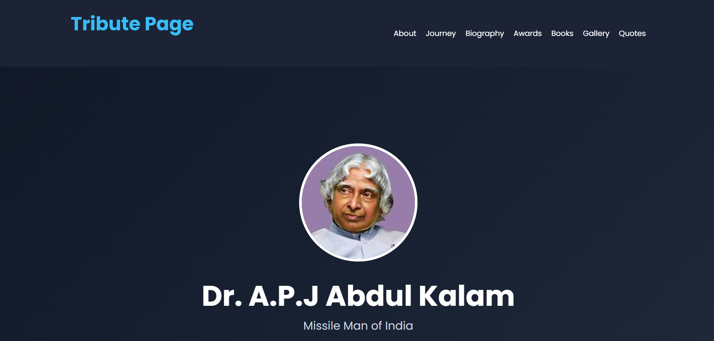
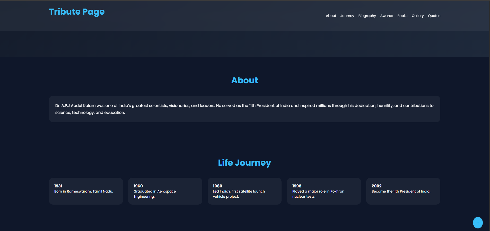
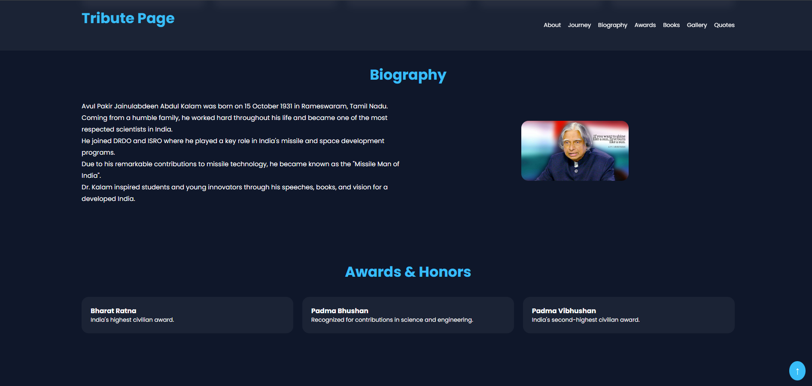
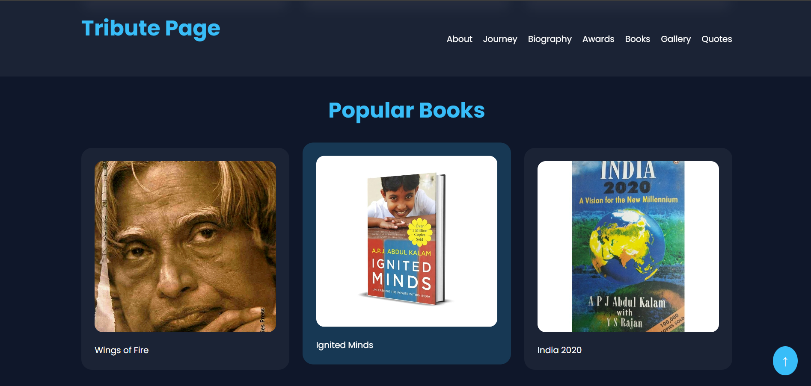
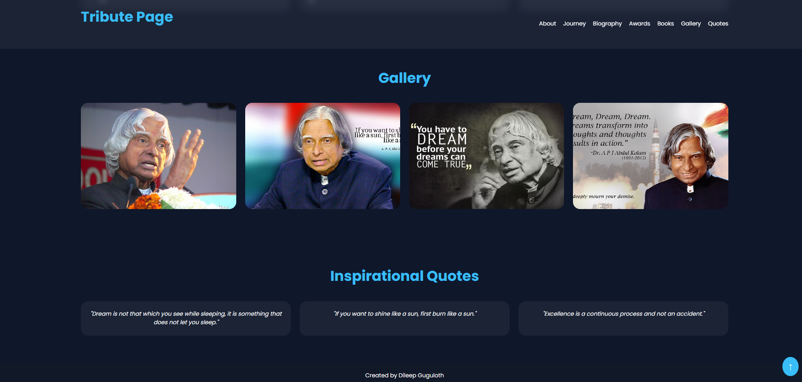

# OIBSIP - Tribute Page

This repository contains the Level 2 Task project completed as part of the Oasis Infobyte Web Development and Designing Internship.

---

# 🚀 Project Name

Tribute Page - Dr. A.P.J Abdul Kalam

---

# 📌 Description

A modern and responsive Tribute Page dedicated to Dr. A.P.J Abdul Kalam, the Missile Man of India.

This project highlights the life, achievements, inspirational journey, books, awards, and quotes of Dr. Kalam through an attractive and interactive user interface.

The webpage includes smooth scrolling navigation, modern UI sections, gallery showcase, and responsive design for all devices.

---

# ✨ Features

## 🌟 Main Features

- Responsive Design
- Modern User Interface
- Smooth Scrolling Navigation
- Hero Section
- Detailed Biography Section
- Timeline of Life Journey
- Awards & Honors Section
- Popular Books Section
- Inspirational Quotes
- Image Gallery
- Scroll To Top Button

## 🎨 UI Features

- Hover Animations
- Smooth Transitions
- Mobile Friendly Layout
- Dark Theme Design
- Interactive Navigation Bar
- Attractive Card Layouts

---

# 🛠️ Technologies Used

- HTML5
- CSS3
- JavaScript

---

# 📸 Screenshots

## 🏠 Hero Section



## 📖 About & Life Journey



## 🏆 Biography & Awards Section



## 📚 Popular Books Section



## 🖼️ Gallery & Quotes Section



---

# 📂 Project Structure

```text
Tribute-Page/
│
├── index.html
├── style.css
├── script.js
├── README.md
│
└── images/
    ├── hero-section.png
    ├── books-section.png
    ├── gallery-section.png
    ├── about-section.png
    └── biography-section.png
```

---

# 📖 About The Project

This tribute webpage highlights the life, achievements, and inspirational journey of Dr. A.P.J Abdul Kalam.

The website includes:

- Biography
- Awards & Honors
- Books written by Dr. Kalam
- Inspirational Quotes
- Photo Gallery
- Timeline of achievements

The project is designed with a clean modern layout and fully responsive interface for better user experience.

---

# 🎯 Objective

The objective of this project is to improve frontend web development skills by creating an attractive and responsive tribute webpage using HTML, CSS, and JavaScript.

---

# 📱 Responsive Design

The webpage is fully responsive and optimized for:

- Desktop
- Laptop
- Tablet
- Mobile Devices

---

# 🔥 Live Demo

https://dileep2609.github.io/OIBSIP/Tribute-Page/

---

# 🎥 Project Demo Video

[Watch Demo Video](https://youtu.be/vE_X5kBKS30)

---

# 💡 Internship Task Details

- Internship Domain: Web Development and Designing
- Internship Provider: Oasis Infobyte
- Level: Level 2

---

# 👨‍💻 Author

Dileep Guguloth

---

# 🏢 Internship

Oasis Infobyte - Web Development and Designing Internship

---

# ⭐ Acknowledgement

Special thanks to Oasis Infobyte for providing this opportunity to enhance practical frontend web development and UI design skills.
