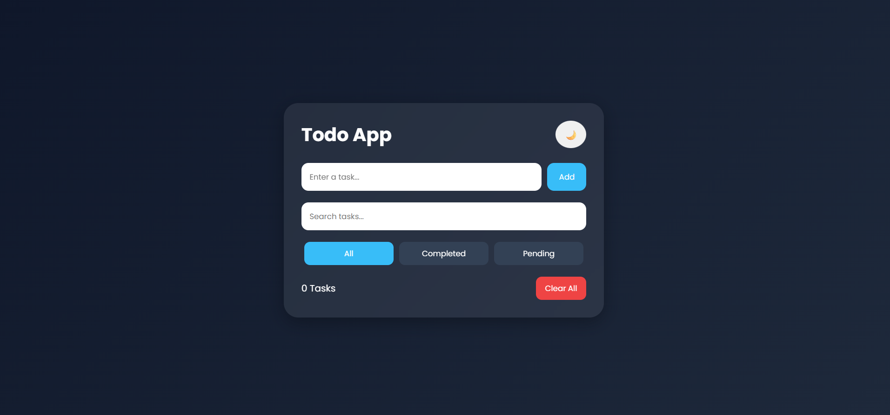
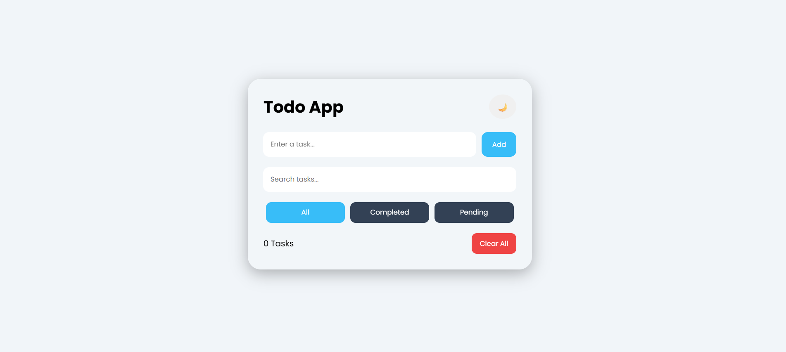
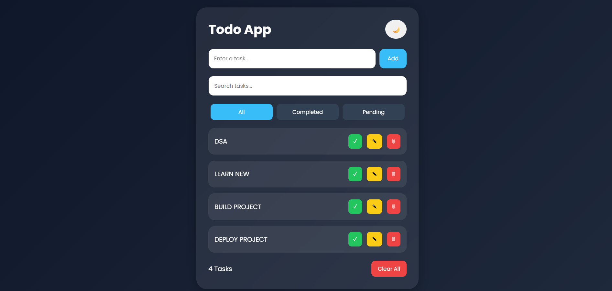
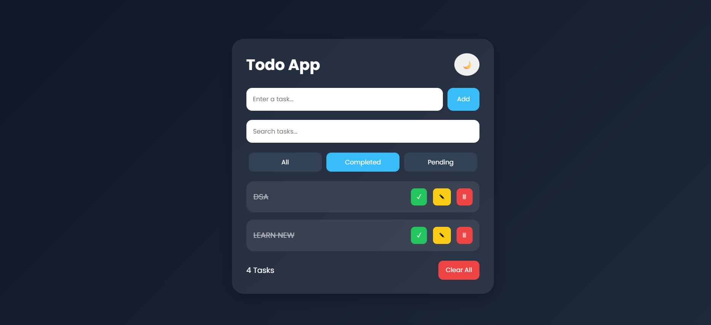
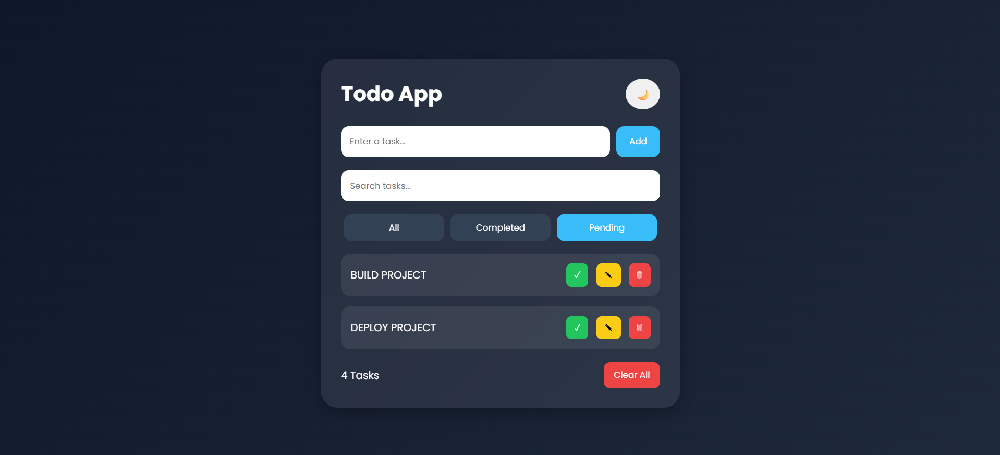

# OIBSIP - Todo Web App

This repository contains the Level 2 Task project completed as part of the Oasis Infobyte Web Development and Designing Internship.

---

# 🚀 Project Name

Todo Web App

---

# 📌 Description

A modern and responsive Todo Web Application built using HTML, CSS, and JavaScript.

This application helps users efficiently manage daily tasks with features like adding, editing, deleting, searching, filtering, and storing tasks using Local Storage. The app also supports dark/light mode with a clean modern UI.

---

# ✨ Features

## ✅ Task Management Features

- Add Tasks
- Edit Tasks
- Delete Tasks
- Mark Tasks as Completed
- Search Tasks
- Filter Tasks
- Task Counter
- Clear All Tasks Button

## 🎨 UI Features

- Dark / Light Mode
- Responsive Design
- Smooth Animations
- Mobile Friendly UI
- Modern Interface
- Dynamic Task Updates

## 💾 Storage Features

- Local Storage Support
- Persistent Task Saving

---

# 🛠️ Technologies Used

- HTML5
- CSS3
- JavaScript

---

# 📸 Screenshots

## 🌙 Dark Mode



## ☀️ Light Mode



## 📋 Multiple Tasks



## ✅ Completed Tasks



## 📌 Pending Tasks



---

# 📂 Project Structure

```text
Todo-App/
│
├── index.html
├── style.css
├── script.js
├── README.md
│
└── images/
    ├── light-mode.png
    ├── dark-mode.png
    ├── completed-tasks.png
    ├── pending-tasks.png
    └── multiple-tasks.png

```

---

# 📖 About The Project

This Todo Web Application helps users manage daily tasks efficiently.

Users can:

- Add new tasks
- Edit existing tasks
- Delete completed tasks
- Search tasks instantly
- Filter completed and pending tasks
- Store tasks permanently using Local Storage

The application also provides a responsive and modern UI experience with dark/light mode support.

---

# 🎯 Objective

The objective of this project is to improve JavaScript skills by implementing:

- DOM Manipulation
- Event Handling
- Local Storage
- Responsive UI Design
- Dynamic Task Management

---

# 📱 Responsive Design

The application is fully responsive and works smoothly on:

- Desktop
- Laptop
- Tablet
- Mobile Devices

---

# 🔥 Live Demo

[Watch Live Demo](https://dileep2609.github.io/OIBSIP/Dileep_Task3_TodoApp/)

---

# 🎥 Project Demo Video

[Watch Demo Video](https://youtu.be/XhFIQcksEKk)

---

# 💡 Internship Task Details

- Internship Domain: Web Development and Designing
- Internship Provider: Oasis Infobyte
- Level: Level 2

---

# 👨‍💻 Author

Dileep Guguloth

---

# 🏢 Internship

Oasis Infobyte - Web Development and Designing Internship

---

# ⭐ Acknowledgement

Special thanks to Oasis Infobyte for providing this opportunity to enhance practical frontend web development and UI design skills.
