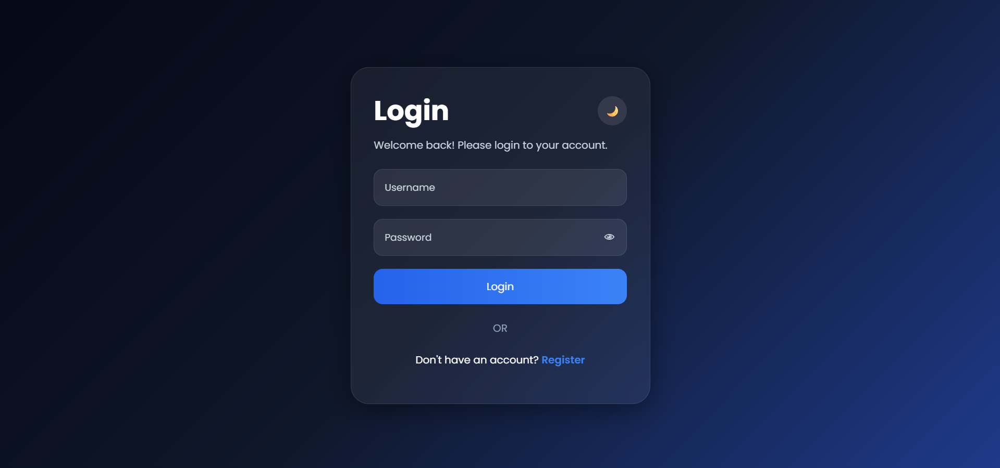
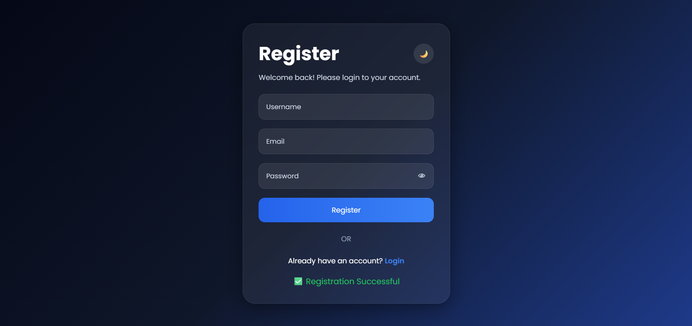
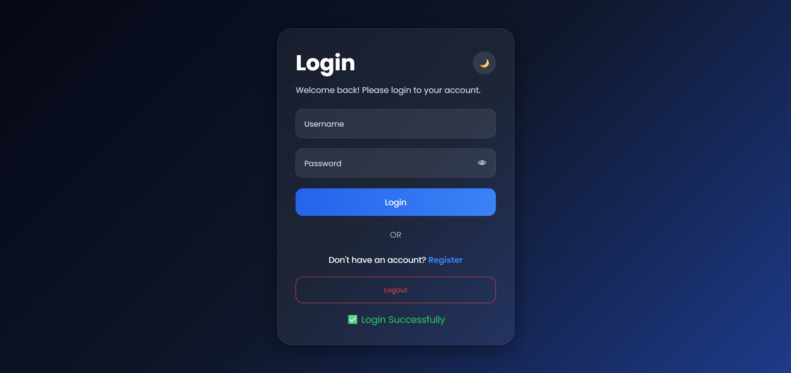

# OIBSIP - Login Authentication System

This repository contains the Level 2 Task project completed as part of the Oasis Infobyte Web Development and Designing Internship.

---

# 🚀 Project Name

Login Authentication System

---

# 📌 Description

A modern and responsive Login Authentication System built using HTML, CSS, and JavaScript.

This project allows users to register, login, logout, and manage authentication using Local Storage. The application also includes dark/light mode support, password visibility toggle, responsive design, and modern UI animations.

---

# ✨ Features

## 🔐 Authentication Features

- User Registration
- User Login
- Logout Functionality
- Local Storage Authentication
- Password Visibility Toggle
- Form Validation

## 🎨 UI Features

- Responsive Design
- Dark / Light Mode
- Modern Glassmorphism UI
- Animated Interface
- Smooth Hover Effects
- Success & Error Messages
- Mobile Friendly Design
- Gradient Background

---

# 🛠️ Technologies Used

- HTML5
- CSS3
- JavaScript

---

# 📸 Screenshots

## 🌙 Login Page - Dark Mode



## 📝 Registration Page



## ✅ Successful Login



---

# 📂 Project Structure

```text
Login-Authentication/
│
├── index.html
├── style.css
├── script.js
├── README.md
│
└── images/
    ├── login-dark.png
    ├── register-page.png
    └── login-success.png
```

---

# 📖 About The Project

This Login Authentication System allows users to:

- Register a new account
- Login securely
- Logout from the system
- Toggle password visibility
- Store user credentials using Local Storage

The project also includes a modern responsive UI with smooth animations and dark/light mode support.

---

# 🎯 Objective

The objective of this project is to improve frontend web development skills by implementing:

- Authentication Logic
- Form Validation
- DOM Manipulation
- Local Storage
- Responsive Web Design
- UI/UX Design

---

# 📱 Responsive Design

The application is fully responsive and optimized for:

- Desktop
- Laptop
- Tablet
- Mobile Devices

---

# 🔥 Live Demo

https://dileep2609.github.io/OIBSIP/Login-Authentication/

---

# 🎥 Project Demo Video

[Watch Demo Video](https://youtu.be/1I35g2HJOMY)

---

# 💡 Internship Task Details

- Internship Domain: Web Development and Designing
- Internship Provider: Oasis Infobyte
- Level: Level 2

---

# 👨‍💻 Author

Dileep Guguloth

---

# 🏢 Internship

Oasis Infobyte - Web Development and Designing Internship

---

# ⭐ Acknowledgement

Special thanks to Oasis Infobyte for providing this opportunity to enhance practical frontend web development and UI design skills.
